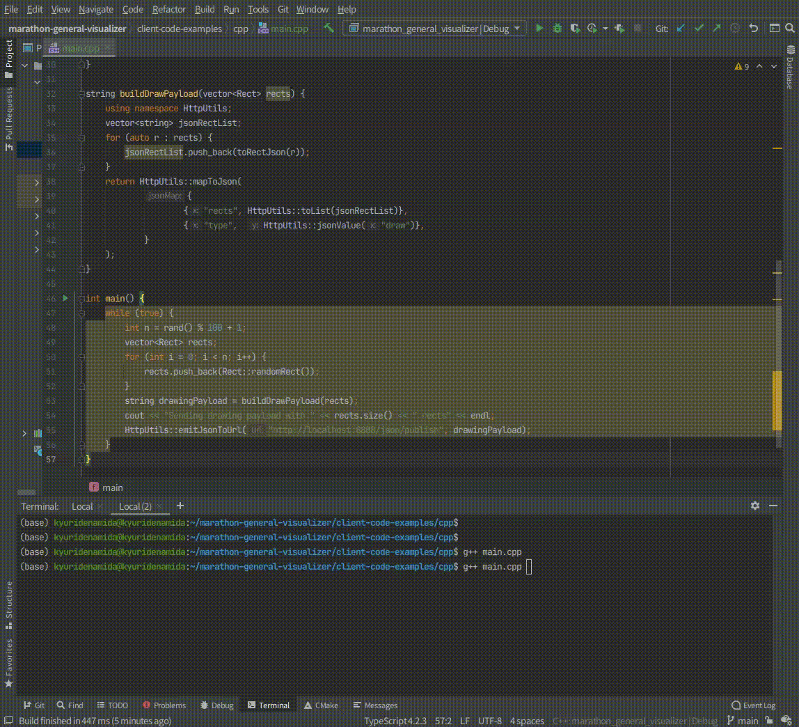
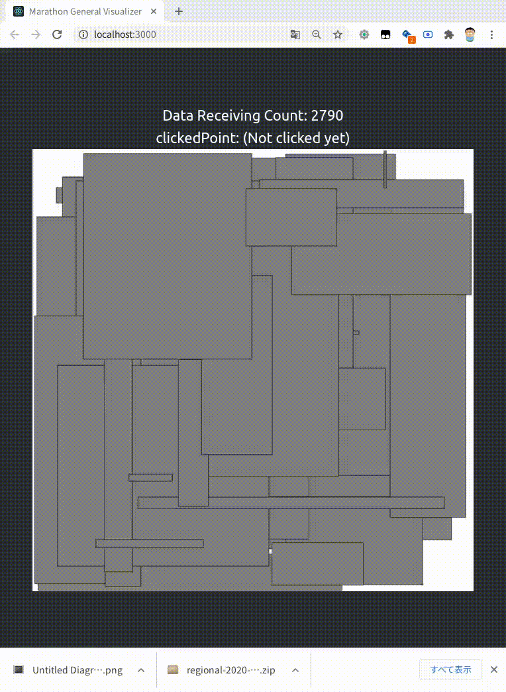
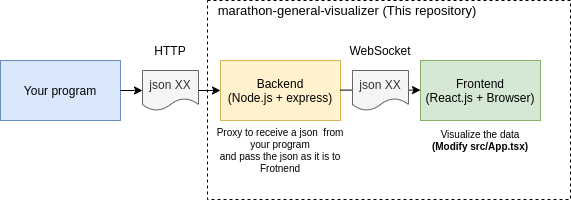

# Marathon General Visualizer

A general browser-based simple real-time visualization framework designed for the marathon match purpose, which works in the local machines.


## Demo

### Sending json data from your program ([/client-code-examples/cpp/main.cpp](/client-code-examples/cpp/main.cpp))


### Rendering the sent data real-time in Frontend 


---

## Required software
- npm (Node Package Manager)

## Required knowledge

- HTML / CSS / Javascript / [JSON](https://www.google.com/search?q=JSON) / [Canvas](https://www.google.com/search?q=canvas+javascript)
- React
- Typescript
- Basic Knowledge of HTTP

## How to use

To start Visualizer (Frontend with auto-reload + Backend), run the following command in your terminal in the project root
directory.

```
npm i # INSTALL PACKAGES
npm start
```

To access Frontend, open http://localhost:3000/ in your browser.

To send a json message from your program to Backend, call a POST request with the json body
to http://localhost:8888/json/publish

## Request example for the sample visualizer

Launch the visualizer and access http://localhost:3000/ and then run the following commands in your terminal (You may need to install curl command.)

### Render rectangles
```sh
curl --location --request POST 'http://localhost:3000/json/publish' \
--header 'Content-Type: application/json' \
--data-raw '{
    "type": "draw",
    "rects": [
        {"l": 100, "r": 200, "d": 100, "u": 200},
         {"l": 300,"r": 400,"d": 300,"u": 400}
    ]
}'
```

### Reset canvas with a color
```sh
curl --location --request POST 'http://localhost:3000/json/publish' \
--header 'Content-Type: application/json' \
--data-raw '{
    "type": "reset",
    "resetColor": "#eeffee"
}'
```

## How it works



Backend ([/src-backend/index.ts](/src-backend/index.ts)) receives a JSON message from your program via HTTP, and Backend passes the json message to Frontend as it is.

You need to customize your program so that it can send a json message using HTTP ([C++ Example](/client-code-examples/cpp/main.cpp)), and also you need to write Frontend
code ([src/App.tsx](/src/App.tsx)) for your own visualization.

You actually don't need to understand how backend works in most cases.

## Trouble Shooting

### Q. Hot-reload doesn't work on the web browser

A. Try the following command.

```
echo fs.inotify.max_user_watches=524288 | sudo tee -a /etc/sysctl.conf && sudo sysctl -p
```

### Q. I posted a json to /json/publish, but nothing happens on the frontend.

A. Make sure your json is valid. A common mistake is having a string literal or key without double-quotes.

You can also check the error message in the backend server log to understand what is problematic.


## Contact

[@kyuridenamida](https://twitter.com/kyuridenamida)

# License

MIT