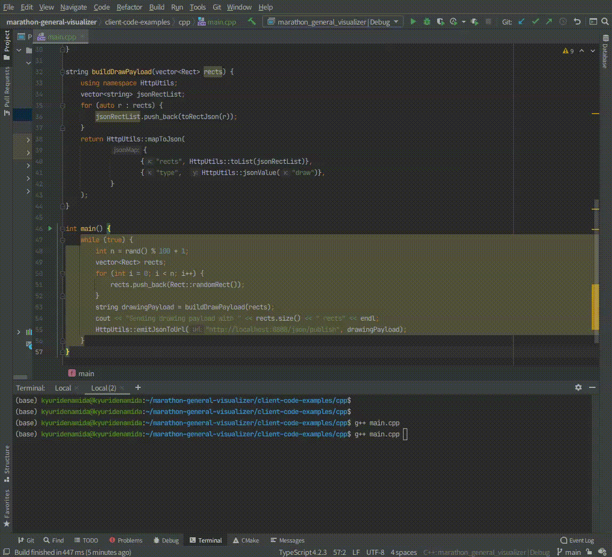
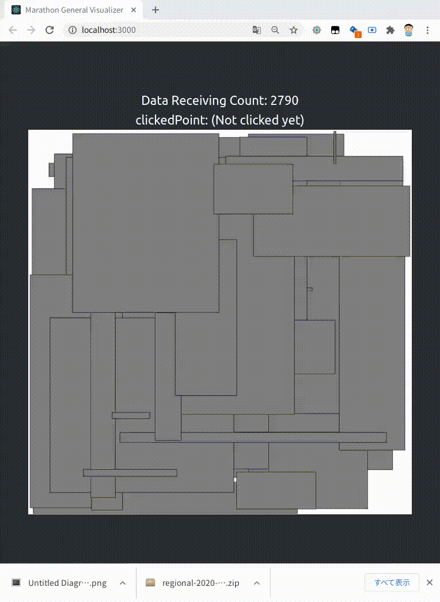

# Marathon General Visualizer


Webブラウザで動作するマラソンマッチ用のローカル環境で動作する簡易リアルタイムビジュアライザフレームワークです。

A general browser-based simple real-time visualization framework designed for the marathon match purpose, which works in
the local machines.

[English version README is available here](README-en.md)

## デモ (Demo)

### JSONデータを送れるようにしたあなたのプログラム 


### ブラウザにリアルタイムでレンダリング


---

## 必要なソフトウェア

- npm (Node Package Manager)

## 必要な知識

- HTML / CSS / Javascript / [JSON](https://www.google.com/search?q=JSON)
  / [Canvas](https://www.google.com/search?q=canvas+javascript)
- React
- Typescript
- HTTPに関する基本的な知識

## 使用法

ビジュアライザ(フロントエンド+バックエンド)を起動するためには以下のコマンドをプロジェクトルートディレクトリで実行します。

```
npm i # INSTALL PACKAGES
npm start
```

フロントエンドにアクセスするためにはhttp://localhost:3000/ をブラウザで開きます。

JSONメッセージをあなたのプログラムからBackendに送信するためにはjsonボディを含んだPOSTリクエストを http://localhost:8888/json/publish に送ります。

# サンプルビジュアライザで試せるリクエストの例

ビジュアライザを起動してhttp://localhost:3000/ にアクセスした状態で下記のコマンドをターミナルで実行してみてください。 (curlコマンドのインストールが必要です。)

### 長方形をレンダリングする

```sh
curl --location --request POST 'http://localhost:3000/json/publish' \
--header 'Content-Type: application/json' \
--data-raw '{
    "type": "draw",
    "rects": [
        {"l": 100, "r": 200, "d": 100, "u": 200},
         {"l": 300,"r": 400,"d": 300,"u": 400}
    ]
}'
```

### 指定した色でキャンバスをリセットする

```sh
curl --location --request POST 'http://localhost:3000/json/publish' \
--header 'Content-Type: application/json' \
--data-raw '{
    "type": "reset",
    "resetColor": "#eeffee"
}'
```

## 仕組み (How it works)!


バックエンドはあなたのプログラムからHTTPを通じて任意のJSONメッセージを受取り、それをフロントエンドにそのまま渡します。

あなたのプログラムをHTTPを通じてjsonメッセージを送れるように改良してください。 またフロントエンド(src/App.tsx)にそれをビジュアライズするコードを書いてください。

実はバックエンドについて学ぶ必要があるケースはほとんどありません。

## トラブルシューティング

### Q. ホットリロードがブラウザで動きません。

A. 以下のコマンドを試してみてください。

```
echo fs.inotify.max_user_watches=524288 | sudo tee -a /etc/sysctl.conf && sudo sysctl -p
```

### Q. /json/publishにjsonを送信しましたが、フロントエンドで何も起きません。

A. jsonが正しいことを確認してください。文字列リテラルやキーをダブルクオテーション(")なしで送ってしまいがちです。

バックエンドログのエラーメッセージを確認すると何が起きているかがわかるかもしれません。

## Contact

[@kyuridenamida](https://twitter.com/kyuridenamida)

# License

MIT