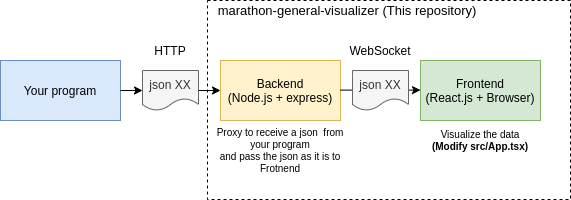

# Marathon General Visualizer

Webブラウザで動作するマラソンマッチ用のローカル環境で動作する簡易リアルタイムビジュアライザフレームワークです。

A general browser-based simple real-time visualization framework designed for the marathon match purpose, which works in the local machines.

## 必要なソフトウェア (Required softwares)

- npm (Node Package Manager)

## 必要な知識 (Required knowledge)

- HTML / CSS / Javascript / [JSON](https://www.google.com/search?q=JSON) / [Canvas](https://www.google.com/search?q=canvas+javascript)
- React
- Typescript
- Knowledge of HTTP

## 使用法 (How to use)

ビジュアライザ(フロントエンド+バックエンド)を起動するためには以下のコマンドをプロジェクトルートディレクトリで実行します。

To start Visualizer (Frontend with auto-reload + Backend), run the following command in your terminal in the project root
directory.

```
npm i # INSTALL PACKAGES
npm start
```

フロントエンドにアクセスするためにはhttp://localhost:3000/ をブラウザで開きます。

To access Frontend, open http://localhost:3000/ in your browser.

JSONメッセージをあなたのプログラムからBackendに送信するためにはjsonボディを含んだPOSTリクエストを http://localhost:8888/json/publish に送ります。

To send a json message from your program to Backend, call a POST request with the json body
to http://localhost:8888/json/publish

# サンプルビジュアライザで試せるリクエストの例 (Request example for the sample visualizer)

ビジュアライザを起動してhttp://localhost:3000/ にアクセスした状態で下記のコマンドをターミナルで実行してみてください。 (curlコマンドのインストールが必要です。) 

Launch the visualizer and access http://localhost:3000/ and then run the following commands in your terminal (You may need to install curl command.)

### 長方形をレンダリングする (Render rectangles)
```sh
curl --location --request POST 'http://localhost:3000/json/publish' \
--header 'Content-Type: application/json' \
--data-raw '{
    "type": "draw",
    "rects": [
        {"l": 100, "r": 200, "d": 100, "u": 200},
         {"l": 300,"r": 400,"d": 300,"u": 400}
    ]
}'
```

### 色でリセットする (Reset colos)
```sh
curl --location --request POST 'http://localhost:3000/json/publish' \
--header 'Content-Type: application/json' \
--data-raw '{
    "type": "reset",
    "resetColor": "#eeffee"
}'
```

## 仕組み (How it works)!



バックエンドはあなたのプログラムからHTTPを通じて任意のJSONメッセージを受取り、それをフロントエンドにそのまま渡します。

あなたのプログラムをHTTPを通じてjsonメッセージを送れるように改良してください。 またフロントエンド(src/App.tsx)にそれをビジュアライズするコードを書いてください。

実はバックエンドについて学ぶ必要があるケースはほとんどありません。

Backend receives a JSON message from your program via HTTP, and Backend passes the json message to Frontend as it is.

You need to customize your program so that it can send a json message using HTTP, and also you need to write Frontend
code (src/App.tsx) for your own visualization.

You actually don't need to understand how backend works in most cases.

## トラブルシューティング (Trouble Shooting)

### Q. ホットリロードがブラウザで動きません。 (Q. Hot-reload doesn't work on the web browser)

A. 以下のコマンドを試してみてください。

A. Try the following command.

```
echo fs.inotify.max_user_watches=524288 | sudo tee -a /etc/sysctl.conf && sudo sysctl -p
```

### Q. /json/publishにjsonを送信しましたが、フロントエンドで何も起きません。 (I posted a json to /json/publish, but nothing happens on the frontend.)

A. jsonが正しいことを確認してください。文字列リテラルやキーをダブルクオテーション(")なしで送ってしまいがちです。

A. Make sure your json is valid. A common mistake is having a string literal or key without double-quotes.

バックエンドログのエラーメッセージを確認すると何が起きているかがわかるかもしれません。

You can also check the error message in the backend server log to understand what is problematic.


## Contact

[@kyuridenamida](https://twitter.com/kyuridenamida)

# License

MIT